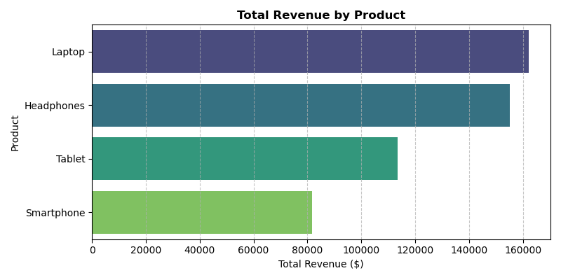
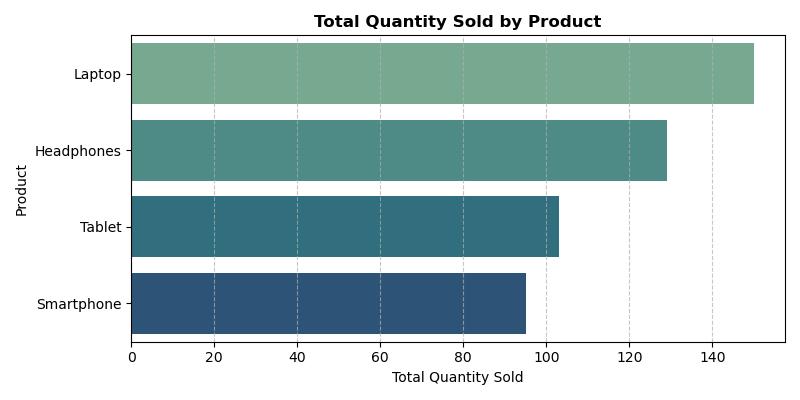
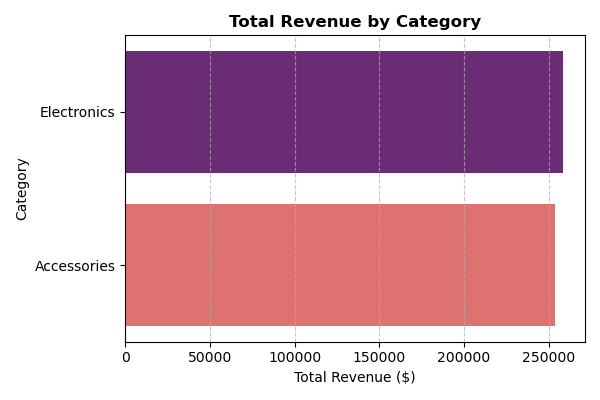
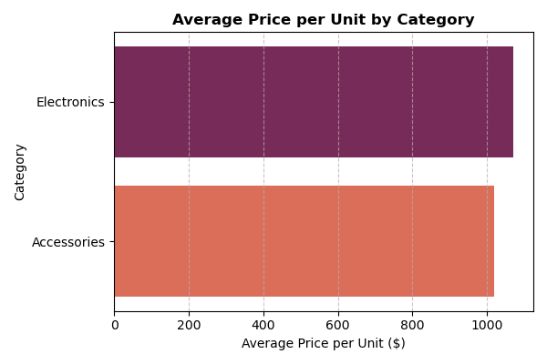

E-commerce Sales Analysis

# Project Overview

In this project, I explored a real-world e-commerce sales dataset to uncover meaningful business insights. The aim was to analyze product performance, pricing trends, and category-level revenue to support data-driven decisions.

These kinds of insights are especially valuable for improving inventory planning, guiding marketing strategies, and understanding what drives the most revenue. This project was designed to reflect a real-world business use case and build my end-to-end data analysis and storytelling skills.

# Objectives

- Clean and prepare raw sales data for analysis
- Identify top-performing products and categories
- Understand product pricing patterns
- Present key insights through visualizations
- Practice structuring a complete data project for portfolio use

# Dataset Info

- Source: [Kaggle – E-commerce Sales Dataset](https://www.kaggle.com/datasets/bismasajjad/e-commerce-sales-dataset)
- Scope: 100 sales transactions (sample size for exploration)
- Columns:
  - Order_ID – unique ID for each transaction
  - Product – product name
  - Category – product category (Electronics or Accessories)
  - Quantity – units sold
  - Price_per_Unit – price of one unit
  - Total_Sale – total revenue from that order

# Tools & Libraries Used

- Python – for all analysis and logic
- Pandas – data manipulation and wrangling
- Matplotlib & Seaborn – creating visuals
- Jupyter Notebook – for exploration and presentation
- Git + GitHub – for version control and sharing

# What I Did?

1. Data Cleaning
- Checked for duplicates and nulls
- Removed invalid data (e.g., negative quantities)
- Verified Total_Sale by recalculating it from quantity × price
- Ensured numeric columns were correctly typed

2. Exploratory Data Analysis (EDA)
- Grouped by product and category to understand sales and popularity
- Ranked top products by both revenue and quantity sold
- Compared category-level averages and revenue totals
- Calculated per-order sales to look for outliers and large transactions

3. Visualizations
- Horizontal bar charts showing:
  - Revenue by product
  - Revenue by category
  - Units sold per product
  - Average price per category
- Visuals saved for GitHub display and sharing

4. Key Insights
- Laptops are both the most popular and highest-revenue product
- Electronics slightly outperform Accessories in both revenue and pricing
- Products with higher average prices don’t always sell in higher quantities
- There’s potential to optimize pricing and promotion strategies based on demand

# Sample Visuals

### Revenue by Product

### Quantity Sold

### Revenue by Category

### Average Price per Category

# Business Impact

This kind of analysis helps e-commerce businesses:

- Promote high-revenue and high-demand products like Laptops
- Adjust inventory levels for top categories during peak periods
- Consider pricing tweaks on popular items in underperforming categories
- Align marketing spend with product performance

# Limitations & Future Work

- Dataset size: Only 100 records — useful for practice, but not enough for forecasting or statistical modeling
- No time data: Limits ability to explore trends over time or seasonality
- No customer info: Can’t analyze buyer behavior or segment customers yet

# Future Plans
In future iterations, I’d like to:
- Incorporate time series data to forecast future sales
- Add customer data to explore loyalty and segmentation
- Build a recommendation system or simple ML model based on purchase patterns

# Final Thoughts

This project was a hands-on opportunity to apply core data wrangling, visualization, and business analysis skills using Python. It also helped me practice writing cleaner code, using GitHub effectively, and communicating findings in a clear, structured way.

